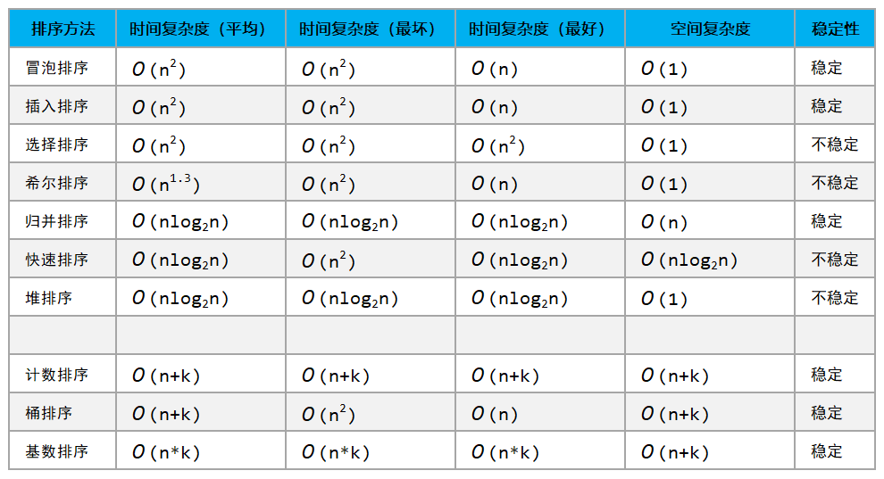

# 十大排序算法总结（JavaScript实现）




``` js
function swap(arr, i, j) {
  var temp = arr[i];
  arr[i] = arr[j];
  arr[j] = temp;
}

function swap(arr, i, j) {
  [arr[i], arr[j]] = [arr[j], arr[i]]
}
```

## 冒泡排序
冒泡排序是一种简单的排序算法。它重复地走访过要排序的数列，一次比较两个元素，如果它们的顺序错误就把它们交换过来。走访数列的工作是重复地进行直到没有再需要交换，也就是说该数列已经排序完成。这个算法的名字由来是因为越小的元素会经由交换慢慢“浮”到数列的顶端。 

1. 比较相邻的元素。如果第一个比第二个大，就交换它们两个；
2. 对每一对相邻元素作同样的工作，从开始第一对到结尾的最后一对，这样在最后的元素应该会是最大的数；
3. 针对所有的元素重复以上的步骤，除了最后一个；
4. 重复步骤1~3，直到排序完成。


``` js
function bubbleSort(arr) {
  var len = arr.length;
  for (var i = 0; i < len - 1; i++) {
    for (var j = 0; j < len - 1 - i; j++) {
      if (arr[j] > arr[j + 1]) {
        swap(arr, j, j+1);
      }
    }
  }
  return arr;
}
```

## 插入排序
**工作原理：**
> 通过构建有序序列，对于未排序数据，在已排序序列中从后向前扫描，找到相应位置并插入。

**过程描述：**
> 1. 从第一个元素开始，该元素可以认为已经被排序；
> 2. 取出下一个元素，在已经排序的元素序列中从后向前扫描；
> 3. 如果该元素（已排序）大于新元素，将该元素移到下一位置；
> 4. 重复步骤3，直到找到已排序的元素小于或者等于新元素的位置；
> 5. 将新元素插入到该位置后；
> 6. 重复步骤2~5。

**动画图解：**


**代码示例：**
``` js
function insertionSort(arr) {
  let len = arr.length;
  let preIndex, current;
  for (let i = 1; i < len; i++) {
    preIndex = i - 1;
    current = arr[i];
    while (preIndex >= 0 && arr[preIndex] > current) {
      arr[preIndex + 1] = arr[preIndex];
      preIndex--;
    }
    arr[preIndex + 1] = current;
  }
  return arr;
}
```

## 选择排序

``` js
function selectionSort(arr) {
  var len = arr.length;
  var minIndex, temp;
  for (var i = 0; i < len - 1; i++) {
    minIndex = i;
    for (var j = i + 1; j < len; j++) {
      if (arr[j] < arr[minIndex]) {
        minIndex = j;
      }
    }
    swap(arr, i, minIndex);
  }
  return arr;
} 
```

## 希尔排序

``` js
function shellSort(arr) {
  var len = arr.length,
    temp,
    gap = 1;
  while (gap < len / 3) {         // 动态定义间隔序列
    gap = gap * 3 + 1;
  }
  for (gap; gap > 0; gap = Math.floor(gap / 3)) {
    for (var i = gap; i < len; i++) {
      temp = arr[i];
      for (var j = i - gap; j > 0 && arr[j] > temp; j -= gap) {
        arr[j + gap] = arr[j];
      }
      arr[j + gap] = temp;
    }
  }
  return arr;
}
```

## 归并排序

``` js
function mergeSort(arr) {
  var len = arr.length;
  if (len < 2) {
    return arr;
  }
  var middle = Math.floor(len / 2),
    left = arr.slice(0, middle),
    right = arr.slice(middle);
  return merge(mergeSort(left), mergeSort(right));
}

function merge(left, right) {
  var result = [];

  while (left.length > 0 && right.length > 0) {
    if (left[0] <= right[0]) {
      result.push(left.shift());
    } else {
      result.push(right.shift());
    }
  }

  while (left.length)
    result.push(left.shift());

  while (right.length)
    result.push(right.shift());

  return result;
}
```

## 快速排序

``` js
function quickSort(arr, left, right) {
  var len = arr.length,
    partitionIndex,
    left = typeof left != 'number' ? 0 : left,
    right = typeof right != 'number' ? len - 1 : right;

  if (left < right) {
    partitionIndex = partition(arr, left, right);
    quickSort(arr, left, partitionIndex - 1);
    quickSort(arr, partitionIndex + 1, right);
  }
  return arr;
}

function partition(arr, left, right) {
  var pivot = left,
      slow = pivot + 1;
  for (var fast = slow; fast <= right; i++) {
    if (arr[fast] < arr[pivot]) {
      swap(arr, fast, slow);
      slow++;
    }
  }
  swap(arr, pivot, slow - 1);
  return slow - 1;
}

function swap(arr, i, j) {
  var temp = arr[i];
  arr[i] = arr[j];
  arr[j] = temp;
}
```


