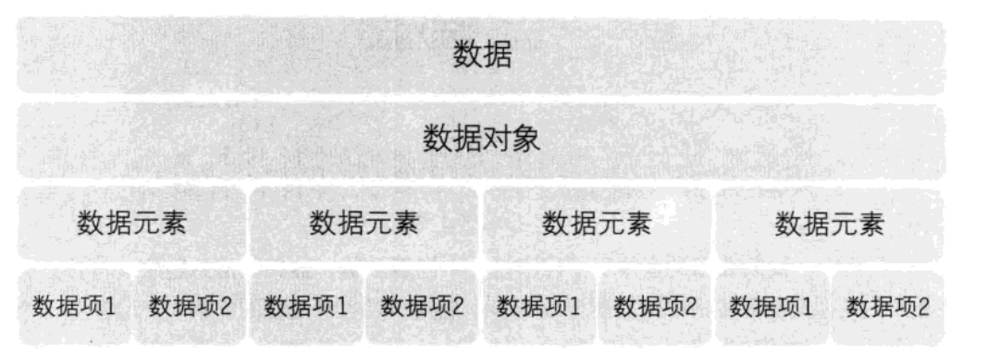

# A-Plan——A计划

**项目来源：** A计划项目是我对于数据结构与算法学习过程的总结，和一些感悟和体会的分享。A来源于单词 `algorithm` (算法)的第一个字母，同时也是26个英文字母中第一个字母，寓意着数据结构和算法在编程领域中的重要性。

从事开发工作四年，深刻认识到算法对于程序员的重要性，对于没有接受计算机专业课熏陶的我来说，这次学习是个十分重要的决定。另外，也希望通过我的分享，让更多的人从零到一的拾起数据结构与算法这个体系性的知识，并且掌握一定的算法设计能力。

不得不说，从零开始学习数据结构和算法，对于非科班出身的程序员来说，还是存在一定困难。我觉得最大的困难是缺乏一个行之有效的学习思路。这个项目希望通过我，由浅入深的学习数据结构和算法给大家一个借鉴，祝福每个希望学好数据结构和算法的程序员能够找到自己在学习这方面知识的合理方法。

## 学习阶段

1. 对于基础概念的认识和理解
2. 对于基本数据结构的认识和理解
3. 对于基本数据结构的增删查改方法的学习和理解
4. 通过第三点初步接触算法的奥妙
5. 学习十大经典排序算法，理解、掌握
6. 认识五大经典算法，理解、掌握、运用
7. 刷leetcode，由浅入深，分门别类，持之以恒的刷题

## 学习方法

1. 合理的运用网络资源，baidu、Github、Google都是很不错的老师，Github上有很多不错的关于数据结构和算法学习的项目。
2. 合理的运用网上的一些刷题网站，例如leetcode、牛客网，学以致用是快速掌握知识的方法之一，刷题的方法是由浅入深并且分门别类，这样能够起到更好的训练作用。
3. 正确对待网上推荐的一些所谓数据结构和算法学习的经典书籍，我认为这些书籍在建立基础的知识体系之后，在进行深入阅读会更容易理解，也比较不容易被劝退。
4. 要建立起自己的知识体系，就少不了一定的总结，可以通过建立自己Github数据结构和算法项目，或者各种云笔记工具，不断积累自己的学习所得。

## 推荐书籍

> 虽然不推荐大家一开始就阅读相关的经典权威著作，但是对于学有余力，亦或者有了一定的基础的同学来说，啃大部头确实是件大有裨益的事情。

## 数据结构基本概念

官方对于数据结构并没有统一的概念：

> “数据结构是数据对象，以及存在于该对象的实例和组成实例的数据元素之间的各种联系。这种联系可以通过定义相关的函数来给出。”--Sartaj Sahni, 《数据结构、算法与应用》

> “数据结构是ADT（抽象数据类型 Abstract Data Type）的物理实现。”——Clifford A.Shaffer, 《数据结构与算法分析》

> “数据结构（data structure）是计算机中存储、组织数据的方式。通常情况下，精心选择的数据结构可以带来最优效率的算法。”——中文维基百科

* 解决问题方法的效率，跟数据的组织方式有关；
* 解决问题方法的效率，跟空间的利用效率有关；
* 解决问题方法的效率，跟算法的巧妙程度有关；

## 所以到底什么是数据结构？？？

* 数据对象在计算机中的组织方式
  * 逻辑结构
  * 物理存储结构
* 数据对象必定与一系列加在其上的操作相关联
* 完成这些操作所用的方法就是算法

## 抽象数据类型（Abstract Data Type）

* 数据类型
  * 数据对象集
  * 数据集合相关联的操作集
* 抽象：描述数据类型的方法不依赖于具体实现
  * 与存放数据的机器无关
  * 与数据存储的物理结构无关
  * 与实现操作的算法和编程语言均无关

只描述数据对象集和相关操作集“是什么”，并不涉及“如何做到”的问题。

## 什么是算法

* 算法（Algorithm）
  * 一个有限指令集
  * 接受一些输入（有些情况下不需要输入）
  * 产生输出
  * 一定在有限步骤之后终止
  * 每一条指令必须
    * 有充分明确的目标，不可以有歧义
    * 计算机能处理的范围之内
    * 描述应不依赖于任何一种计算机语言以及具体的实现手段

## 什么是好的算法？

* 空间复杂度S(n)——根据算法写成的程序在执行时**占用存储单元的长度**。这个长度往往与输入数据的规模有关。空间复杂度过高的算法可能导致使用的内存超限，造成程序非正常中断。
* 时间复杂度T(n)——根据算法写成的程序在执行时**耗费时间的长度**。这个长度往往也与输入数据的规模有关。时间复杂度过高的低效算法可能导致我们在有生之年都等不到运行结果。

## 什么是好的算法？

* 在分析一般算法的 效率时，我们经常关注下面两种复杂度
  * 最坏情况复杂度 $T_{worst}(n)$
  * 平均复杂度 $T_{avg}(n)$

$$T_{avg}(n) \leq T_{worst}(n)$$

})

### 首先要理解什么是数据

数据：所有能被输入到计算机中，且能被计算机处理的符号的集合。是计算机操作的对象的总称。
数据元素：数据（集合）中的一个“个体”，数据及结构中讨论的基本单位
数据项：数据的不可分割的最小单位。一个数据元素可由若干个数据项组成。
数据类型：在一种程序设计语言中，变量所具有的数据种类。整型、浮点型、字符型等等

抽象的理解，万物皆数据。想象一下在《黑客帝国》中，看起来真实的不行的世界其实是Matrix制造出的虚拟世界，那个世界里面的一切都是数据堆砌起来的。

### 其次，什么是数据结构

比较正式的定义如下：
> 数据结构就是研究数据的逻辑结构和物理结构以及它们之间相互关系，并对这种结构定义相应的运算，而且确保经过这些运算后所得到的新结构仍然是原来的结构类型。

一般来说，比较正式的定义一般的都比较抽象，不便于理解，从利用的角度来理解定义，那么数据结构有什么用呢？

对于给定的数据，通过使用不同的数据结构储存，可以获得不同的效果。例如，数组便于快速访问某一特定位置的值，但会在插入、删除操作中浪费大量时间；链表则便于插入、删除单个元素，但用于访问特定位置的效率却不容乐观。线段树，平衡树则可以加速对于特定信息的检索与维护，如区间和，排名等。灵活地使用数据结构可以对代码的运行效率产生不可忽视的影响。

如果对于这个概念还是一知半解的同学，不用着急，接着往下看，相信你会慢慢明白什么是数据结构。

### 数据结构的分类

一般来说，我们会从 逻辑结构、物理结构 两个维度看待这个问题。

逻辑结构：表示数据之间的相互关系。

在数据结构中,从逻辑上可以将其分为线性结构和非线性结构

* 集合: 结构中的数据元素除了同属于一种类型外，别无其它关系。
* 线性结构: 数据元素之间一对一的关系
* 树形结构: 数据元素之间一对多的关系
* 图状结构或网状结构: 结构中的数据元素之间存在多对多的关系

物理结构/存储结构：数据在计算机中的表示。物理结构是描述数据具体在内存中的存储（如：顺序结构、链式结构、索引结构、哈希结构）等

数据结构的基本操作的设置的最重要的准则是,实现应用程序与存储结构的独立。实现应用程序是“逻辑结构”，存储的是“物理结构”。逻辑结构主要是对该结构操作的设定，物理结构是描述数据具体在内存中的存储（如：顺序结构、链式结构、索引结构、希哈结构）等。
顺序存储结构中，线性表的逻辑顺序和物理顺序总是一致的。但在链式存储结构中，线性表的逻辑顺序和物理顺序一般是不同的。

就目前而言,这些基础概念已经足够使用，贪多嚼不烂。

## 各种数据结构学习目录

`B` - 初学者， `A` - 进阶

* `B` [链表](src/data-structures/linked-list/README.zh-CN.md)
* `B` [双向链表](src/data-structures/doubly-linked-list/README.zh-CN.md)
* `B` [队列](src/data-structures/queue/README.zh-CN.md)
* `B` [栈](src/data-structures/stack/README.zh-CN.md)
* `B` [哈希表](src/data-structures/hash-table/README.zh-CN.md)
* `B` [堆](src/data-structures/heap/README.zh-CN.md) - 最大堆 & 最小堆
* `B` [优先队列](src/data-structures/priority-queue/README.zh-CN.md)
* `A` [字典树](src/data-structures/trie/README.zh-CN.md)
* `A` [树](src/data-structures/tree/README.zh-CN.md)
  * `A` [二叉查找树](src/data-structures/tree/binary-search-tree)
  * `A` [AVL 树](src/data-structures/tree/avl-tree)
  * `A` [红黑树](src/data-structures/tree/red-black-tree)
  * `A` [线段树](src/data-structures/tree/segment-tree) - 使用 `最小/最大/总和` 范围查询示例
  * `A` [树状数组](src/data-structures/tree/fenwick-tree) (二叉索引树)
* `A` [图](src/data-structures/graph/README.zh-CN.md) (有向图与无向图)
* `A` [并查集](src/data-structures/disjoint-set)
* `A` [布隆过滤器](src/data-structures/bloom-filter)

# 算法学习

## Youtube学习资料

* [计算机教程分享][1]

[1]: https://www.youtube.com/channel/UCPmmZVMYWYdycL5uu6SmSog

## 学习算法的好网站

* [VisuAlgo][101]数据结构和算法动态可视化 (Chinese)

[101]: https://visualgo.net/zh